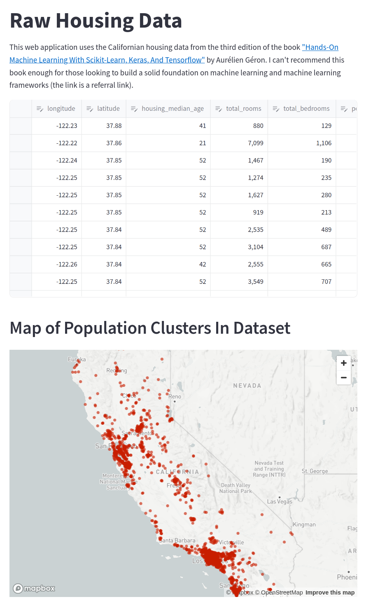
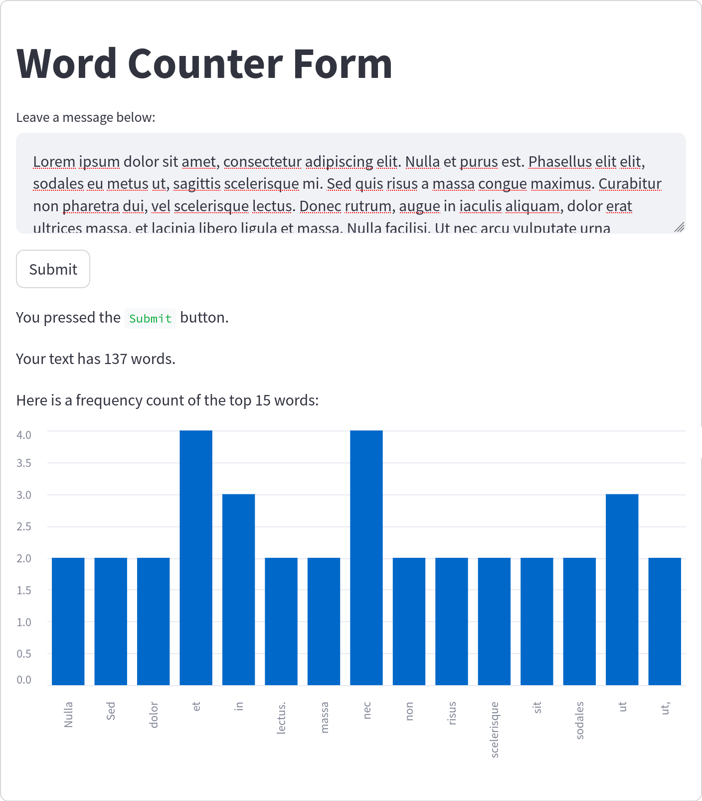

# Housing Price Visualizations

This Streamlit web application uses the Californian housing data from the third edition of the book ["Hands-On Machine Learning With Scikit-Learn, Keras, And Tensorflow"](https://amzn.to/3pC2A5b) by Aurélien Géron. I can't recommend this book enough for those looking to build a solid foundation on machine learning and machine learning frameworks (the link is a referral link).

## Pages
There are three pages in this Streamlit app. The main page shows the pandas dataframe as a table and below it there is a map of the population clusters in the dataset.

Then there is an info page containing some useful links. The third page is a bit more interesting. It has a Streamlit form with a text input area. The script counts the number of words and creates a bar chart of the 15 most common words used in the text:

